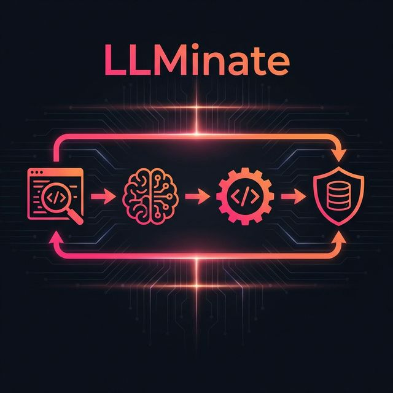

# <p align="center">✨ LLMinate ✨</p>

<p align="center">
  
</p>

<p align="center">
  <strong>The open-source de-LLMifier.</strong> Automate the transition from expensive, high-latency AI calls to efficient, deterministic rule-based logic.
</p>

<p align="center">
  
  
  
  
</p>

---

## 🚀 The Vision

Modern applications are bloated with redundant LLM calls for tasks that could be handled by simple deterministic code. **LLMinate** scans your codebase, identifies these "over-engineered" AI interactions, infers their intent, and synthesizes local, high-performance logic to replace them.

**Reduce Latency from 2000ms ➔ 2ms. Reduce Cost from $0.01 ➔ $0.00.**

---

## 🛠️ Key Features

- 🔍 **Deep Static Scanning**: Leverages `semgrep` and `tree-sitter` to find LLM client instantiations across multi-language projects.
- 🧠 **Intent Inference**: Uses secondary LLM analysis to determine *why* a call is being made (e.g., "This call is just classifying a sentiment").
- ⚙️ **Deterministic Synthesis**: Generates local Python/JS functions that mimic the AI's behavior without the external dependency.
- 🛡️ **Shadow Validation**: Validates synthesized logic by running it in parallel with the live AI call, tracking match rates and latency gains.
- 📋 **Rule Store**: A searchable registry of pre-defined rules for common tasks like data extraction, formatting, and simple logic.
- 🎨 **Premium UI**: A glassmorphic, responsive dashboard to manage your refactor pipeline.

---

## 🏗️ Architecture

1.  **Scanner**: Static analysis detects AI calls in your local or remote (Git) repository.
2.  **Reasoner**: LLM-based agent analyzes the call context and prompt to understand the underlying logic.
3.  **Synthesizer**: Generates a deterministic function (Regex, Rule-based, or Lightweight ML) to replace the call.
4.  **Validator**: Runs the new code against test cases or shadow data to ensure behavioral parity.

---

## 🚦 Getting Started

### Prerequisites

- **Python 3.10+** (Backend)
- **Node.js 18+** (Frontend)
- **API Keys**: Access to OpenAI, Anthropic, or Google Gemini.

### Installation

1.  **Clone & Configure**
    ```bash
    git clone https://github.com/rrb115/LLMinate.git
    cd LLMinate
    cp .env.example .env
    ```
    *Update `.env` with your API keys.*

2.  **Environment Setup**
    ```bash
    python -m venv .venv
    source .venv/bin/activate
    pip install -r requirements.txt
    ```

3.  **Frontend Installation**
    ```bash
    cd frontend
    npm install
    ```

### Running Locally

You will need two terminals:

**Terminal 1: Backend**
```bash
# From root
source .venv/bin/activate
uvicorn app.main:app --reload --port 8000 --app-dir backend
```

**Terminal 2: Frontend**
```bash
# From root
cd frontend
npm run dev
```

---

## 📖 Usage Guide

1.  **Scan**: Enter the absolute path to your project in the "Scan Setup" tab.
2.  **Review**: Select detected "Candidates" from the sidebar.
3.  **Inspect**: Review the extracted logic and the proposed "Shadow" metrics.
4.  **Refactor**: Apply the patch directly to your repository via the UI.

---

## 🛡️ Security & Privacy

LLMinate respects your codebase.
- **Local First**: All scanning and analysis happen on your machine.
- **Rule Isolation**: Synthesized rules are stored in `backend/app/rules/private/` and are git-ignored by default.
- **Safety Flags**: No patches are applied without explicit developer confirmation.

---

## 🤝 Contributing

We welcome contributions! Whether it's adding support for new AI providers, improving the synthesis engine, or polishing the UI.

1.  Fork the Project
2.  Create your Feature Branch (`git checkout -b feature/AmazingFeature`)
3.  Commit your Changes (`git commit -m 'Add some AmazingFeature'`)
4.  Push to the Branch (`git push origin feature/AmazingFeature`)
5.  Open a Pull Request

---

## 📄 License

Distributed under the MIT License. See `LICENSE` for more information.

<p align="center">
  Built with ❤️ for the deterministic future.
</p>
